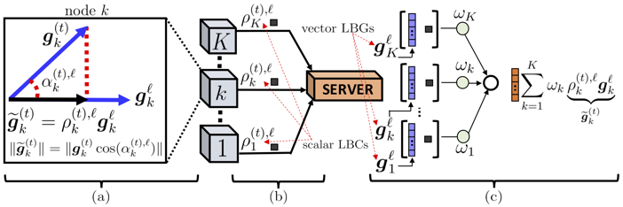

# FedOptim



- Paper on [OpenReview](https://openreview.net/pdf?id=B7ZbqNLDn-_)
- ArXiv: [Recycling Model Updates in Federated Learning: Are Gradient Subspaces Low-Rank?](https://arxiv.org/abs/2202.00280)
- Data: We currently do not have a permanent link to the data (including model parameters, gradient history for generating plots). However, please feel free to reach out to me and we will try to figure a way out to share the data dump with you. The total data size is over 600 GB. If you need a subset of the data dump, it might be easier to share over dropbox or google drive.

### Setup

```bash
# preferred
conda create --name <env-name> --file conda.txt

# or
python3 -m venv <env-name>
source <env-name>/bin/activate
pip install -r pip.txt
```

### Running Experiments

- to check the exact function names please refer to the shell scripts

```bash
cd src

# to run centralized experiments
# generates the gradients for preliminary experiments
sh sh/train_central_<cnn|fcn|resnet|svm|unet|vgg>.sh <dataset-name>

# to run federated baselines
sh sh/train_federated_<cnn|fcn|resnet|unet|vgg>.sh <dataset-name> <num-classes-per-node>

# to run distributed baselines
sh sh/train_distributed_<cnn|fcn|resnet|unet|vgg>.sh <dataset-name> <num-classes-per-node>

# to run standalone lbgm
sh sh/train_lbgm_<cnn|fcn|resnet|unet|vgg>.sh <dataset-name> <num-classes-per-node>

# to run plug-n-play baselines
sh sh/train_<signsgd|atomo|topk>.sh <dataset-name> <num-classes-per-node> <algorithm-hyperparams>

# to run plug-n-play lbgm
sh sh/train_<signsgd|atomo|topk>_lbgm.sh <dataset-name> <num-classes-per-node> <algorithm-hyperparams>
```

### Generating plots

- to check the exact function names please refer to the shell scripts
- standalone plots are generated using script: `src/sh/expt_1_standalone_with_acc_comm_curve.sh`
- plug-n-play plots are generated using script: `src/sh/expt_2_plugnplay_with_acc_comm_curve.sh`
- plots exploring the effect of error threshold use: `src/sh/expt_3_threshold_with_acc_comm_curve.sh`
- distributed plots are generated using script: `src/sh/expt_4_distributed_with_acc_comm_curve.sh`

```bash
# to process gradients for preliminary visualizations
sh sh/process_grads.sh <dataset-name>

# to generate preliminary visualizations
sh sh/prelim_<1|2|3>.sh <dataset-name|svm|seg> f

# to generate plots for exploratory experiments
sh sh/expt_<1|2|3|4>_standalone_with_acc_comm_curve.sh <main|pfl|sampled|architecture-name>_<iid|non_iid> f 
```

### Citation
If you find the [repository](https://github.com/shams-sam/FedOptim) or the [paper](https://openreview.net/forum?id=B7ZbqNLDn-_) useful, please cite the following paper
```
@inproceedings{
  azam2022recycling,
  title={Recycling Model Updates in Federated Learning: Are Gradient Subspaces Low-Rank?},
  author={Sheikh Shams Azam and Seyyedali Hosseinalipour and Qiang Qiu and Christopher Brinton},
  booktitle={International Conference on Learning Representations},
  year={2022},
  url={https://openreview.net/forum?id=B7ZbqNLDn-_}
}
```
